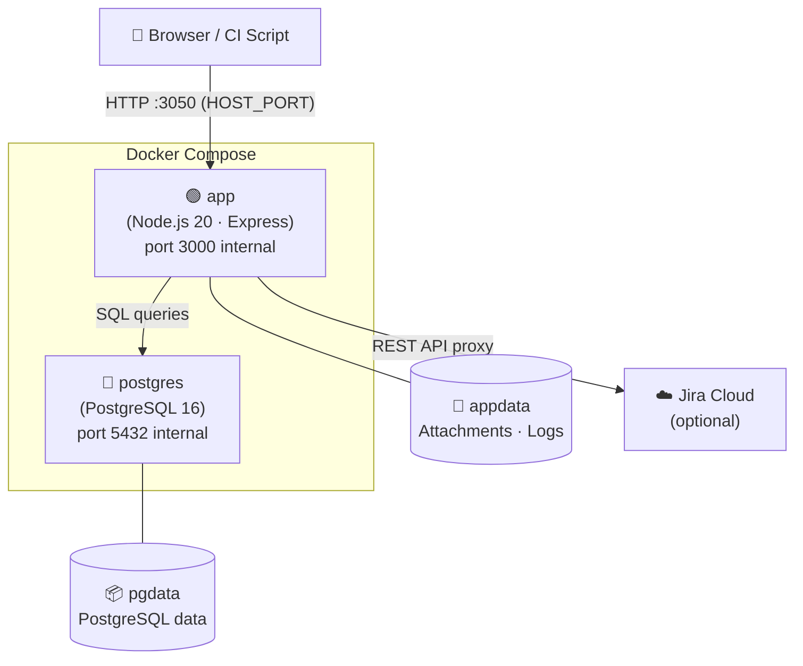

# LTCM — Lightweight Test Case Manager

A self-hosted web app for small QA teams. Replaces Excel-based test case management with a clean UI for writing test cases, running test sessions, logging results, and exporting reports.

**Source:** [github.com/CorithLabs/LTCM](https://github.com/CorithLabs/LTCM)

---

## Quick Start — Docker (recommended)

Requires [Docker Desktop](https://www.docker.com/products/docker-desktop/).

```bash
git clone https://github.com/CorithLabs/LTCM.git
cd LTCM

# Copy env template and set your secrets
cp .env.example .env.local
# Edit SESSION_SECRET at minimum before running in production

docker compose up -d
```

Open **http://localhost:3050**

Default admin credentials: `admin` / `admin` — you'll be prompted to change the password on first login.

To stop: `docker compose down`
To update: `git pull && docker compose up -d --build`

---

## Manual Setup (no Docker)

**Requirements:** Node.js 20+, PostgreSQL 14+

```bash
git clone https://github.com/CorithLabs/LTCM.git
cd LTCM

# 1. Create the database
createdb ltcm

# 2. Copy env template and configure
cp .env.example .env.local
# Edit DATABASE_URL and SESSION_SECRET

# 3. Install dependencies and build the frontend
npm run setup

# 4. Start
npm start
```

Open **http://localhost:3000**

---

## Development

```bash
# Install deps (root + client)
npm run setup

# Start backend + Vite dev server concurrently
npm run dev
```

- Backend: http://localhost:3000 (API)
- Frontend: http://localhost:5173 (hot reload, proxies API to :3000)

---

## Environment Variables

Copy `.env.example` to `.env.local` and adjust:

| Variable | Required | Description |
|---|---|---|
| `DATABASE_URL` | Yes | PostgreSQL connection URL |
| `SESSION_SECRET` | Yes | Long random string for session signing |
| `PORT` | No | Server port (default: `3000`) |
| `JIRA_ENCRYPTION_KEY` | No | Auto-generated on first run if not set |

Generate a secure secret:
```bash
node -e "console.log(require('crypto').randomBytes(32).toString('hex'))"
```

---

## Deployment Architecture



> The app container serves both the API and the pre-built React frontend.
> PostgreSQL and app data are persisted in named Docker volumes — safe across `docker compose down` and restarts.

---

## Hosting

LTCM is designed to be self-hosted via Docker. Three common setups:

**VPS (DigitalOcean, Hetzner, Linode, AWS EC2, etc.)**
Any Linux VM with Docker installed works. Steps:
```bash
# On your server
git clone https://github.com/CorithLabs/LTCM.git && cd LTCM
cp .env.example .env.local
# Edit .env.local — set a strong SESSION_SECRET
docker compose up -d
```
Put nginx in front for HTTPS. The app binds to port `3050` by default (`HOST_PORT` in `.env.local`).

**Local network**
Run on a shared dev machine and access it by IP. Zero ops cost — good for co-located teams.

**Any container platform**
The `Dockerfile` is a standard two-stage build (Node 20 Alpine). Works on any platform that runs Docker containers.

---

## Tech Stack

| Layer | Technology |
|---|---|
| Backend | Node.js 20, Express 4, PostgreSQL (via `pg`) |
| Frontend | React 18, TypeScript, Vite, Tailwind CSS, React Query |
| Auth | Session-based (express-session + connect-pg-simple) |
| File storage | Local disk (`data/attachments/`) |

---

## Features

- Multi-user with roles (admin / tester)
- Projects → Suites → Test Cases hierarchy
- Test run sessions with Pass / Fail / Skip / Blocked / N/A per case
- Auto-save during runs (500ms debounce)
- Run history with vs-last-run diff
- CSV and HTML/PDF export
- Jira integration — link cases to issues, auto-transition on result
- Full-text search
- Backup & restore (JSON)
- Admin: user management, access logs, app logs
